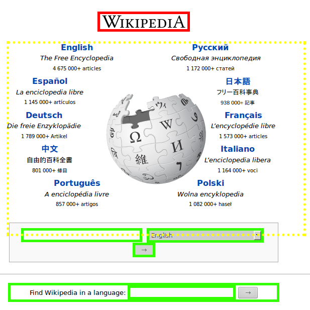

# CSS Diagnostics Bookmarklet

> Fastest html code diagnostics



Inspired by [CSS Diagnostics](http://css-tricks.com/snippets/css/css-diagnostics/)

## Install
Copy [bookmarklet code](./dist/bookmarklet.js) to your URL bar

## Build
run
```sh
gulp
```

## License
MIT © [Vladimir Rodkin](https://github.com/VovanR)
